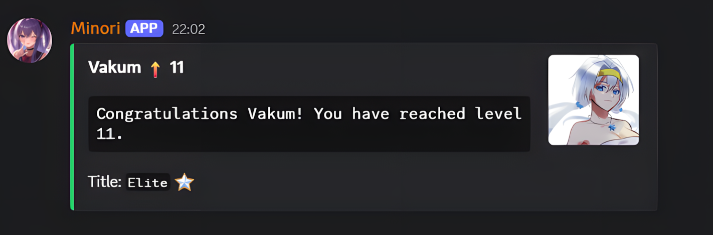
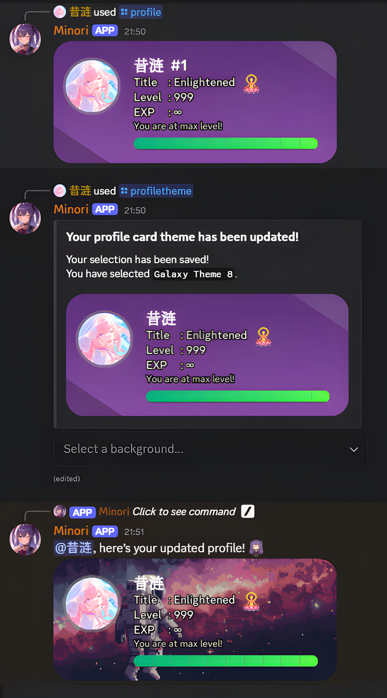
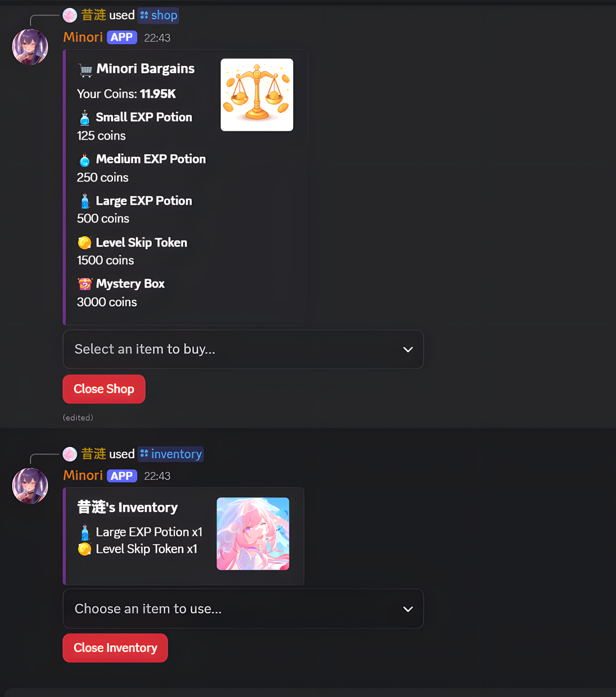
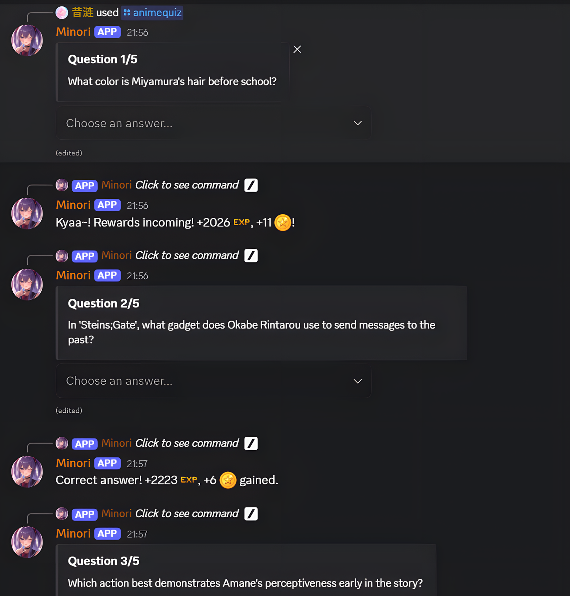
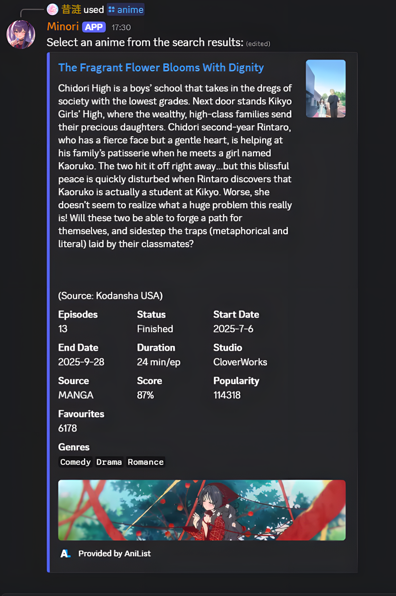

EN | [中文](docs/readmeCN.md)

<h1 align="center">AniAvatar Discord Bot (Minori)</h1>

<p align="center">
  
  
  
  
</p>

<p align="center">
  
</p>

**AniAvatar** (appearing on Discord as **Minori**) is a feature-rich bot built with Python and `discord.py`. It automates a wide range of anime-related tasks, including searching for information, fetching profile pictures, hosting trivia games, and managing a server-wide leveling and economy system.

---

## ✨ Features

### Progression & Economy
- **EXP & Leveling**: Gain EXP by chatting and playing games.
- **Level Up Alerts**: Receive public notifications on level-ups and rank changes.
- **Automatic Role Assignment**: The bot auto-creates and manages title roles (from *Novice* to *Enlightened*) based on user level.
- **Customizable Profile Cards**: Display your rank, title, and EXP with a personalized card featuring custom themes and backgrounds.
- **Server Leaderboard**: Compete for the top spot on a beautifully rendered leaderboard image.
- **Shop, Inventory & Trading**: Earn coins to spend in the item shop. Manage items in your inventory and donate them to other users.

<details>
  <summary><b>View Progression Previews</b></summary>
  
  
  
  
</details>

### Games & Fun
- **Anime Quiz & Guessing Games**: Test your knowledge with a multiple-choice quiz or a guess-the-character game to earn EXP and coins.
- **Coin Gambling**: Gamble your coins with a dynamic win chance.
- **Waifu & Quotes**: Get random waifu images or memorable quotes from various anime.
- **Polling**: Create custom polls with up to 5 options for the community to vote on.

<details>
  <summary><b>View Games & Fun Previews</b></summary>
  
  
  
</details>

### Anime & Utilities
- **Anime & Character Search**: Get detailed information about any anime or find the perfect profile picture for any character.
- **Server Announcements**: Admins can easily create and send formatted announcements.
- **Dynamic Help Command**: Get a clean, organized list of all available commands.
- **Presence Rotation**: The bot's status rotates every 20 minutes, "watching" a random anime.

<details>
  <summary><b>View Utility Previews</b></summary>
  
  
  
</details>

---

## 🤖 Commands

| Command | Category | Description |
| :--- | :--- | :--- |
| `/profile [user]` | Progression | Displays your or another user's profile card. |
| `/leaderboard` | Progression | Shows the server's top 10 users by EXP. |
| `/profiletheme` | Progression | Choose a custom background theme for your profile card. |
| `/resetprofiletheme` | Progression | Resets your profile card theme to the default. |
| `/shop` | Trading | Opens the item shop to buy consumables like EXP potions. |
| `/inventory` | Trading | Check your inventory and use your items. |
| `/donate <member>` | Trading | Give an item from your inventory to another user. |
| `/anime <query>` | Search | Fetches detailed information about an anime from AniList. |
| `/animepfp <name>` | Search | Finds a profile picture of an anime character. |
| `/animequiz <questions>`| Games | Starts a multiple-choice anime trivia quiz. |
| `/guesscharacter` | Games | Starts a guess-the-character from an image game. |
| `/gamble` | Fun | Gamble your coins with a dynamic win chance. |
| `/waifu` | Fun | Fetches a random waifu image. |
| `/animequotes` | Fun | Gives you a random quote from an anime. |
| `/poll <duration>` | Fun | Creates a poll with custom options via a pop-up modal. |
| `/announce <mention> <channel>` | Admin | (Admin Only) Creates and sends an announcement. |
| `/help` | General | Shows this list of all available commands. |
| `/ping` | General | Checks the bot's latency to Discord's servers. |

---

## 🚀 Getting Started (Self-Hosting)

To run your own instance of Minori, follow these steps.

### 1. Prerequisites
- Python 3.11+
- Git
- A Discord Bot Token from the [Discord Developer Portal](https://discord.com/developers/applications).

### 2. Installation
```bash
# Clone the repository
git clone [https://github.com/Dendroculus/AniAvatar.git](https://github.com/Dendroculus/AniAvatar.git)

# Navigate to the project directory
cd AniAvatar

# Install the required dependencies
pip install -r requirements.txt
```

### 3. Configuration
This bot requires several API keys and custom emojis to function correctly.

#### A. Environment Setup
In your project directory, create a `.env` file and add the following keys. This file is included in `.gitignore` to prevent you from accidentally sharing your secrets.
```env
DISCORD_TOKEN=your_discord_token
GOOGLE_API_KEY=your_google_api_key
GOOGLE_CSE_ID=your_google_cse_id
```

#### B. Google Custom Search API
The `/animepfp` command requires a Google API Key and a Custom Search Engine ID.
<details>
  <summary>Click here for instructions on how to get your Google API keys</summary>
  
  1.  **Get an API Key**
      - Go to the [Google Cloud Console](https://console.cloud.google.com/).
      - Create a new project (or use an existing one).
      - Navigate to **APIs & Services → Credentials**.
      - Click **Create Credentials → API key** and copy the key.

  2.  **Create a Custom Search Engine (CSE)**
      - Visit the [Google Programmable Search Engine](https://programmablesearchengine.google.com/) control panel.
      - Click **Add** to create a new search engine.
      - Under “Sites to search”, enter image-hosting sites like `myanimelist.net`, `anilist.co`, and `zerochan.net`.
      - Create the engine and copy the **Search Engine ID (cx)**.
</details>

#### C. Custom Emojis
The bot uses custom emojis for its UI.
1.  Upload all emojis from the `/assets/other essentials emojis/` directory to a Discord server where your bot is present.
2.  Enable Developer Mode in Discord, right-click each emoji, and copy its ID.
3.  You must update the emoji IDs in the code (primarily in `games.py` and `progression.py`) to match the IDs of your newly uploaded emojis.

### 4. Run the Bot
Once configured, you can start the bot with:
```bash
python main.py
```

---

## 🛠 Built With
- **Framework & Libraries**: Python 3.11+, [discord.py](https://pypi.org/project/discord.py/), [aiohttp](https://docs.aiohttp.org/), [Pillow (PIL)](https://pillow.readthedocs.io/en/stable/)
- **APIs**: [AniList API (GraphQL)](https://anilist.co/graphiql), [Google Custom Search API](https://developers.google.com/custom-search)
- **Database**: SQLite for local storage of profiles, stats, and leveling data.

---

## 📜 License
This project is licensed under the **MIT License**. See the [LICENSE](LICENSE) file for details.

---

## 🙌 Acknowledgements
- Thanks to [Noto Fonts](https://github.com/notofonts/noto-cjk/releases) for providing CJK font support for the profile cards.
- This project is an independent creation and is **not affiliated with, supported by, or endorsed by Discord Inc., AniList, or Google.** All original assets are created by me.