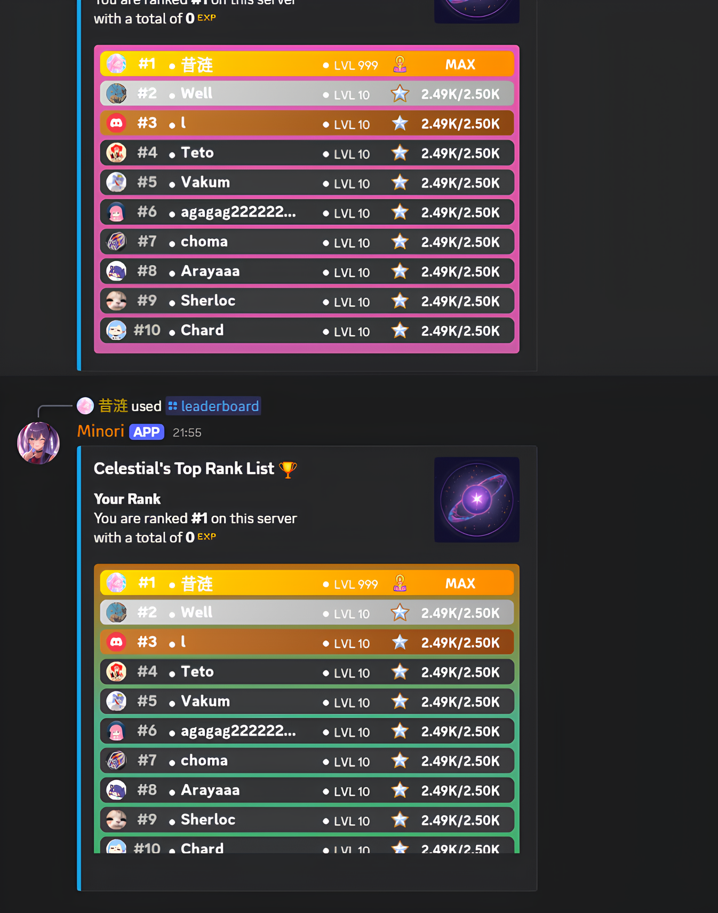
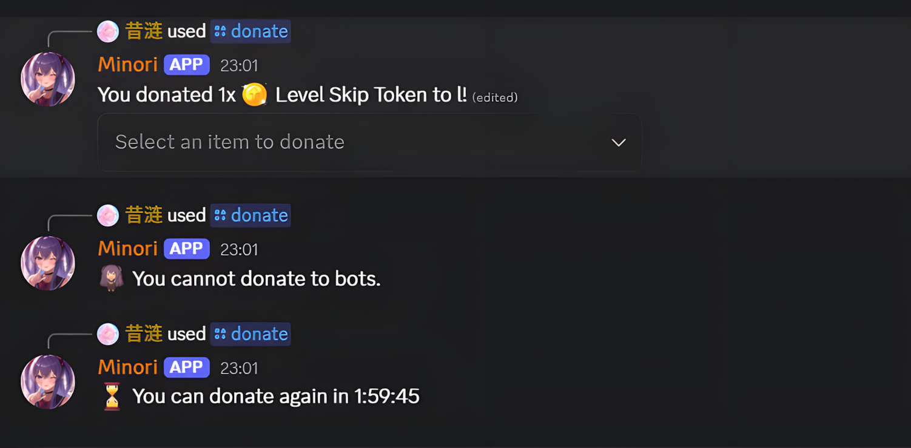
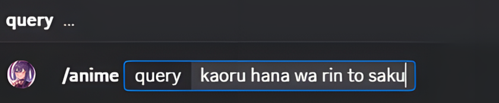
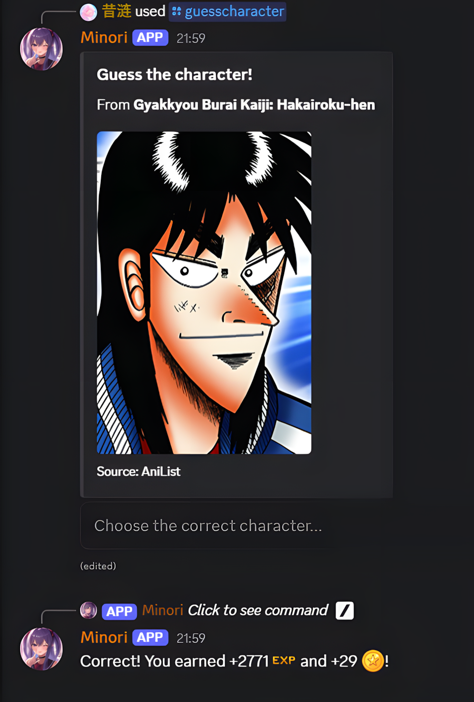
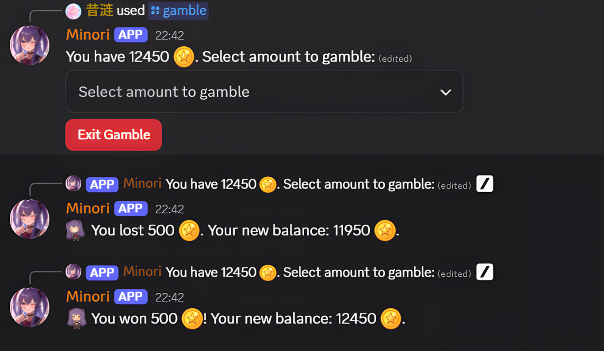

EN  | [中文](docs/readmeCN.md)
# AniAvatar Discord Bot


AniAvatar is the project name. The bot appears on Discord as **Minori**.<br>
AniAvatar is a **Discord bot** built with Python and [discord.py](https://discordpy.readthedocs.io/).
It automates anime-related tasks — search anime info, fetch profile pictures, play trivia, and level up your profile with a full economy system.

**[View Full Bot Documentation](https://your-docs-link-here.com) (Coming Soon!)**

---

## ✨ Features

The bot is structured around several core systems, each with unique features.

### Progression & Economy System
- **EXP & Leveling**: Gain experience points simply by chatting in the server.
- **Level Up Alerts**: Receive a public notification when you level up or achieve a new rank.
  <details>
    <summary>Preview</summary>
    
  </details>
- **Automatic Role Assignment**: As you level up, the bot automatically creates, assigns, and manages title roles (from *Novice* to *Enlightened*), ensuring your status is always reflected.
- **Customizable Profile Cards**: Show off your rank, title, and EXP with a personalized profile card. You can customize the theme and background.
  <details>
    <summary>Preview</summary>
    
  </details>
- **Server Leaderboard**: Compete with other members and see who's at the top with a beautifully rendered leaderboard image.
  <details>
    <summary>Preview</summary>
    
  </details>
- **Shop, Inventory & Trading**: Earn coins by leveling up and playing games. Spend them in the shop on items like EXP potions and mystery boxes. Manage your items in your inventory and donate them to other users.
  <details>
    <summary>Preview</summary>
    
    
  </details>

### Anime Information
- **Anime & Character Search**: Get detailed information about any anime or find the perfect profile picture for any character using the AniList and Google Search APIs.
  <details>
    <summary>Preview</summary>
    <p><b>Anime Search Process:</b></p>
    
    
    
    <p><b>PFP Command:</b></p>
    
  </details>

### Games & Fun
- **Anime Quiz & Guessing Games**: Test your knowledge with a multiple-choice anime quiz or guess the character from a random image. Earn EXP and coins for correct answers!
  <details>
    <summary>Preview</summary>
    
    
  </details>
- **Coin Gambling**: Feeling lucky? Gamble your coins with a dynamic win chance.
  <details>
    <summary>Preview</summary>
    
  </details>
- **Waifu & Quotes**: Get random waifu images or memorable quotes from various anime.
  <details>
    <summary>Preview</summary>
    
    
  </details>
- **Polling**: Create custom polls with up to 5 options for the community to vote on.
  <details>
    <summary>Preview</summary>
    
  </details>

### Admin & Utilities
- **Server Announcements**: Admins can easily create and send formatted announcements to any channel, with an option to mention `@everyone`.
  <details>
    <summary>Preview</summary>
    
  </details>
- **Dynamic Help Command**: Get a clean, organized list of all available commands.
  <details>
    <summary>Preview</summary>
    
  </details>
- **Presence Rotation**: The bot's status rotates every 20 minutes, "watching" a random anime from a list of hundreds.
- **Error Handling**: Gracefully handles incorrect commands and missing permissions to ensure a smooth user experience.

---

## 🤖 Commands

| Command | Category | Description |
| :--- | :--- | :--- |
| `/profile [user]` | Progression | Displays your or another user's profile card. |
| `/leaderboard` | Progression | Shows the server's top 10 users by EXP. |
| `/profiletheme` | Progression | Choose a custom background theme for your profile card. |
| `/resetprofiletheme` | Progression | Resets your profile card theme to the default. |
| `/shop` | Trading | Opens the item shop to buy consumables like EXP potions. |
| `/inventory` | Trading | Check your inventory and use your items. |
| `/donate <member>` | Trading | Give an item from your inventory to another user. |
| `/anime <query>` | Search | Fetches detailed information about an anime from AniList. |
| `/animepfp <name>` | Search | Finds a profile picture of an anime character. |
| `/animequiz <questions>`| Games | Starts a multiple-choice anime trivia quiz. |
| `/guesscharacter` | Games | Starts a guess-the-character from an image game. |
| `/gamble` | Fun | Gamble your coins with a dynamic win chance. |
| `/waifu` | Fun | Fetches a random waifu image. |
| `/animequotes` | Fun | Gives you a random quote from an anime. |
| `/poll <duration>` | Fun | Creates a poll with custom options via a pop-up modal. |
| `/announce <mention> <channel>` | Admin | (Admin Only) Creates and sends an announcement. |
| `/help` | General | Shows this list of all available commands. |
| `/ping` | General | Checks the bot's latency to Discord's servers. |

---

## 🚀 Getting Started (Self-Hosting)

To run your own instance of Minori, follow these steps.

### 1. Prerequisites
- Python 3.11+
- A Discord Bot Token. You can get one from the [Discord Developer Portal](https://discord.com/developers/applications).
- Git

### 2. Installation
```bash
# Clone the repository
git clone https://github.com/Dendroculus/AniAvatar.git

# Navigate to the project directory
cd AniAvatar

# Install the required dependencies
pip install -r requirements.txt
```

### 3. API Configuration
AniAvatar uses the **Google Custom Search API** to fetch anime profile pictures. You’ll need your own **API key** and **Search Engine ID**.

#### A. Get a Google API Key
1. Go to [Google Cloud Console](https://console.cloud.google.com/).
2. Create a new project (or use an existing one).
3. Navigate to **APIs & Services → Credentials**.
4. Click **Create Credentials → API key**.
5. Copy the generated key — this will be your `GOOGLE_API_KEY`.

#### B. Create a Custom Search Engine (CSE)
1. Visit [Google Programmable Search Engine](https://programmablesearchengine.google.com/).
2. Click **Add**.
3. Under “Sites to search”, enter image-hosting sites like `myanimelist.net`, `anilist.co`, and `zerochan.net`.
4. Create the engine and copy the **Search Engine ID (cx)** — this will be your `GOOGLE_CSE_ID`.

### 4. Environment Setup
In your project directory, create a `.env` file. This file is already in `.gitignore` to prevent you from accidentally sharing your secrets. Add your keys to it:

```env
DISCORD_TOKEN=your_discord_token
GOOGLE_API_KEY=your_google_api_key
GOOGLE_CSE_ID=your_google_cse_id
```

### 5. Run the Bot
```bash
python main.py
```

---

## 🛠 Built With
- Python 3.11+
- [discord.py 2.x](https://pypi.org/project/discord.py/)
- [aiohttp](https://docs.aiohttp.org/)
- [Pillow (PIL)](https://pillow.readthedocs.io/en/stable/) for image manipulation
- [AniList API (GraphQL)](https://anilist.co/graphiql) – anime data
- [Google Custom Search API](https://developers.google.com/custom-search) – image search
- SQLite – local database for profiles, stats, and leveling

---

## 📜 License
This project is licensed under the **MIT License** — you are free to use, modify, and distribute it, provided proper credit is given.
See the [LICENSE](LICENSE) file for details.

---

## 🙌 Acknowledgements
Thanks to [Noto Fonts](https://github.com/notofonts/noto-cjk/releases) for providing the CJK font support.

## ⚠️ Disclaimer
AniAvatar is an independent project and is **not affiliated with, supported by, or endorsed by Discord Inc., AniList, or Google.**
All assets (backgrounds, icons, profile cards) are original and created by me.

---
🚧 **Note:** AniAvatar is currently under active development — features and code structure are subject to change.
