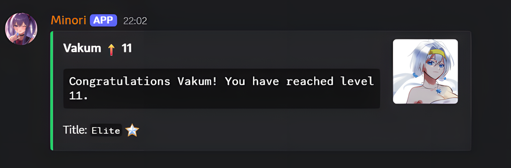
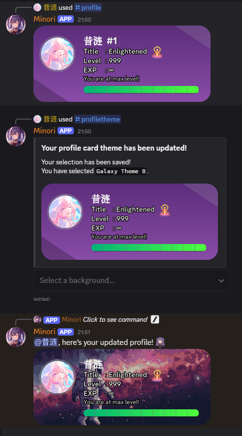
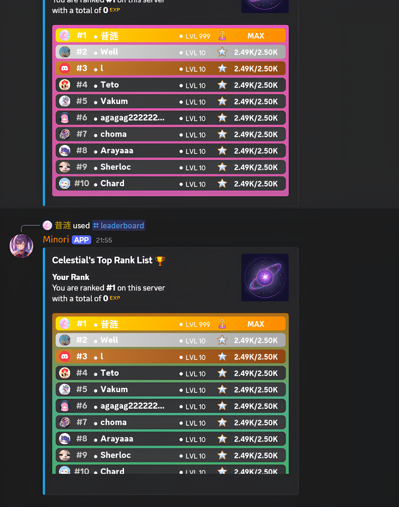
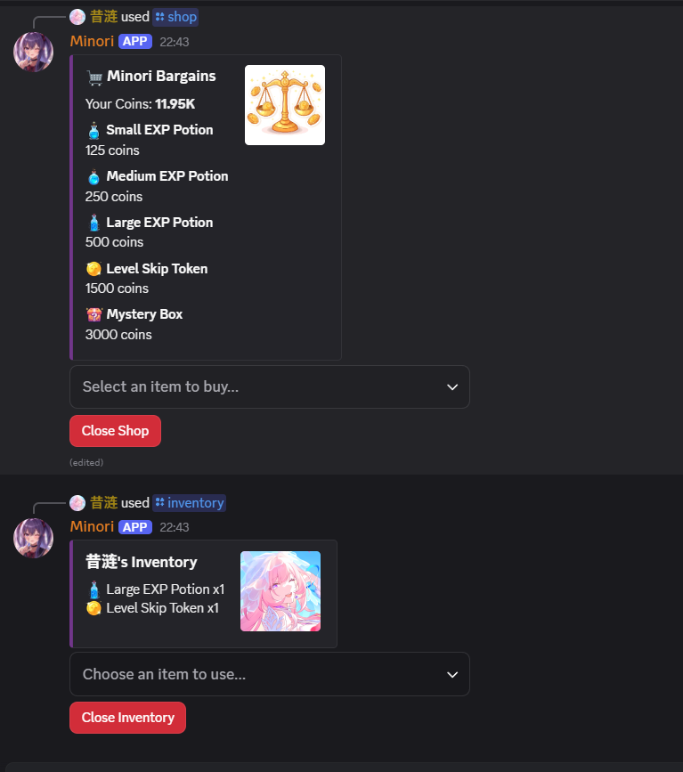
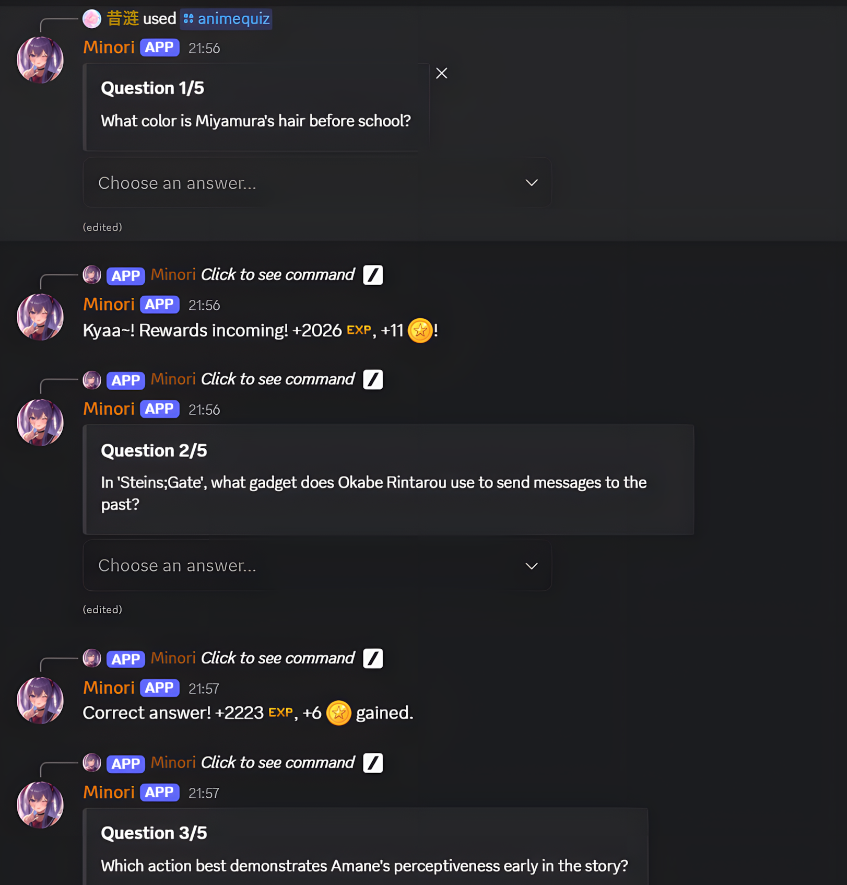
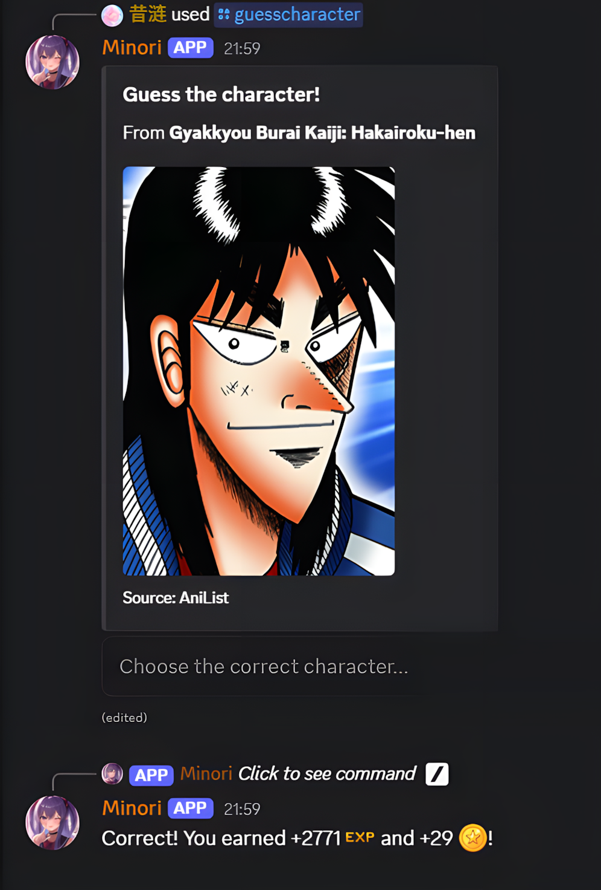
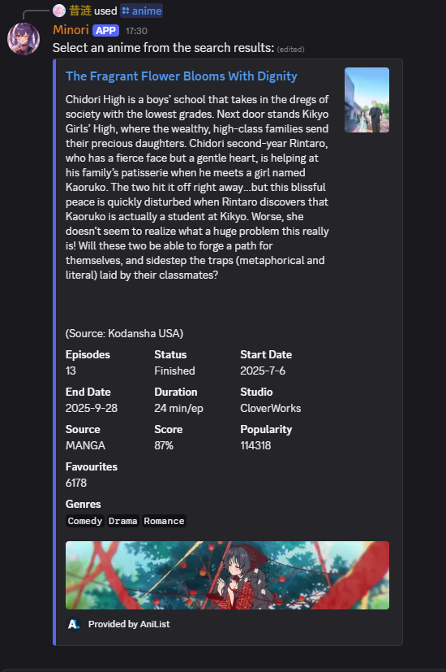
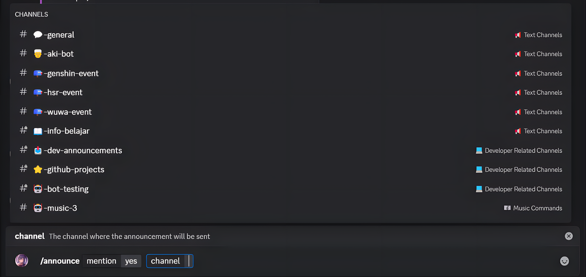
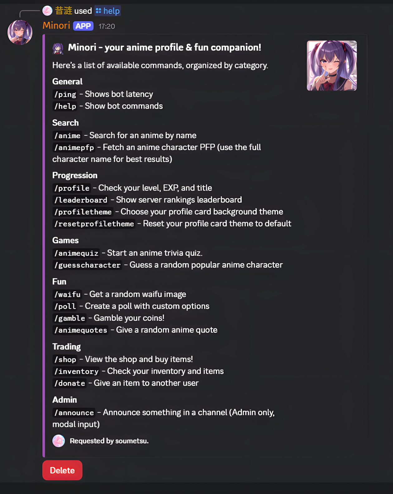

[EN](../README.md) | 中文

<h1 align="center">AniAvatar Discord 机器人 (Minori)</h1>

<p align="center">
  
  
  
  
</p>

<p align="center">
  
</p>

**AniAvatar**（在 Discord 上显示为 **Minori**）是一个功能丰富的机器人，使用 Python 和 `discord.py` 构建。它能自动化处理各种与动漫相关的任务，包括搜索信息、获取头像、主持问答游戏，以及管理服务器范围内的等级和经济系统。

---

## ✨ 主要功能

### 成长与经济系统
- **经验与升级**: 通过在服务器中聊天和玩游戏来获得经验值。
- **升级提醒**: 当您升级或获得新排名时，会收到公开通知。
- **自动分配角色**: 机器人会根据用户等级自动创建、分配和管理称号角色（从*初学者*到*智者*）。
- **可自定义的个人资料卡**: 用一张个性化的卡片展示您的排名、称号和经验值，卡片具有可自定义的主题和背景。
- **服务器排行榜**: 在一个精美渲染的排行榜图片上与其他成员竞争，看看谁是顶尖玩家。
- **商店、物品栏与交易**: 通过升级和玩游戏赚取金币。在物品商店中消费，购买经验药水和神秘盒子等物品。在您的物品栏中管理物品，并将其捐赠给其他用户。

<details>
  <summary><b>查看成长系统预览</b></summary>
  
  
  
  
</details>

### 游戏与娱乐
- **动漫问答与猜谜游戏**: 通过多项选择的问答或猜角色游戏来测试您的知识，以赚取经验值和金币。
- **金币赌博**: 感觉幸运吗？用一个动态的获胜几率来赌您的金币。
- **老婆图与语录**: 获取随机的老婆图片或各种动漫中难忘的语录。
- **投票**: 创建最多包含5个选项的自定义投票，供社区成员投票。

<details>
  <summary><b>查看游戏与娱乐预览</b></summary>
  
  
  
</details>

### 动漫与实用功能
- **动漫与角色搜索**: 获取任何动漫的详细信息，或为任何角色找到完美的头像。
- **服务器公告**: 管理员可以轻松创建并发送格式化的公告。
- **动态帮助命令**: 获取一个干净、有条理的所有可用命令列表。
- **状态轮换**: 机器人的状态每20分钟轮换一次，显示“正在观看”一部随机的动漫。

<details>
  <summary><b>查看实用功能预览</b></summary>
  
  
  
</details>

---

## 🤖 命令列表

| 命令 | 类别 | 描述 |
| :--- | :--- | :--- |
| `/profile [user]` | 成长系统 | 显示您自己或其他用户的个人资料卡。 |
| `/leaderboard` | 成长系统 | 显示服务器经验值排名前10的用户。 |
| `/profiletheme` | 成长系统 | 为您的个人资料卡选择一个自定义背景主题。 |
| `/resetprofiletheme` | 成长系统 | 将您的个人资料卡主题重置为默认值。 |
| `/shop` | 交易 | 打开物品商店以购买经验药水等消耗品。 |
| `/inventory` | 交易 | 查看您的物品栏并使用您的物品。 |
| `/donate <member>` | 交易 | 将您物品栏中的一个物品赠送给另一位用户。 |
| `/anime <query>` | 搜索 | 从 AniList 获取有关动漫的详细信息。 |
| `/animepfp <name>` | 搜索 | 查找动漫角色的头像。 |
| `/animequiz <questions>`| 游戏 | 开始一个多项选择的动漫知识问答。 |
| `/guesscharacter` | 游戏 | 开始一个根据图片猜角色的游戏。 |
| `/gamble` | 娱乐 | 以动态的获胜几率赌您的金币。 |
| `/waifu` | 娱乐 | 获取一张随机的老婆图片。 |
| `/animequotes` | 娱乐 | 获取一句随机的动漫语录。 |
| `/poll <duration>` | 娱乐 | 通过一个弹出窗口创建带有自定义选项的投票。 |
| `/announce <mention> <channel>` | 管理 | (仅限管理员) 创建并发送公告。 |
| `/help` | 通用 | 显示所有可用命令的列表。 |
| `/ping` | 通用 | 检查机器人到 Discord 服务器的延迟。 |

---

## 🚀 快速上手 (自托管)

要运行您自己的 Minori 实例，请按照以下步骤操作。

### 1. 先决条件
- Python 3.11+
- Git
- 一个来自 [Discord 开发者门户](https://discord.com/developers/applications) 的 Discord 机器人令牌。

### 2. 安装步骤
```bash
# 克隆仓库
git clone [https://github.com/Dendroculus/AniAvatar.git](https://github.com/Dendroculus/AniAvatar.git)

# 进入项目目录
cd AniAvatar

# 安装所需的依赖项
pip install -r requirements.txt
```

### 3. 配置
该机器人需要几个 API 密钥和自定义表情符号才能正常工作。

#### A. 环境设置
在您的项目目录中，创建一个 `.env` 文件并添加以下密钥。此文件已包含在 `.gitignore` 中，以防止您意外分享您的机密。
```env
DISCORD_TOKEN=your_discord_token
GOOGLE_API_KEY=your_google_api_key
GOOGLE_CSE_ID=your_google_cse_id
```

#### B. Google 自定义搜索 API
`/animepfp` 命令需要一个 Google API 密钥和一个自定义搜索引擎ID。
<details>
  <summary>点击此处查看如何获取您的 Google API 密钥</summary>
  
  1.  **获取 API 密钥**
      - 前往 [Google Cloud Console](https://console.cloud.google.com/)。
      - 创建一个新项目（或使用现有项目）。
      - 导航到 **API 与服务 → 凭证**。
      - 点击 **创建凭证 → API 密钥** 并复制密钥。

  2.  **创建自定义搜索引擎 (CSE)**
      - 访问 [Google 可编程搜索引擎](https://programmablesearchengine.google.com/) 控制面板。
      - 点击 **添加** 来创建一个新的搜索引擎。
      - 在“要搜索的网站”下，输入图片托管网站，如 `myanimelist.net`、`anilist.co` 和 `zerochan.net`。
      - 创建引擎并复制 **搜索引擎 ID (cx)**。
</details>

#### C. 自定义表情符号
该机器人使用自定义表情符号作为其用户界面的一部分。
1.  将 `/assets/other essentials emojis/` 目录中的所有表情符号上传到您的机器人所在的 Discord 服务器。
2.  在 Discord 中启用开发者模式，右键单击每个表情符号，然后复制其 ID。
3.  您必须更新代码中的表情符号ID（主要在 `games.py` 和 `progression.py` 中），以匹配您新上传的表情符号的ID。

### 4. 运行机器人
配置完成后，您可以使用以下命令启动机器人：
```bash
python main.py
```

---

## 🛠️ 构建技术
- **框架与库**: Python 3.11+, [discord.py](https://pypi.org/project/discord.py/), [aiohttp](https://docs.aiohttp.org/), [Pillow (PIL)](https://pillow.readthedocs.io/en/stable/)
- **API**: [AniList API (GraphQL)](https://anilist.co/graphiql), [Google 自定义搜索 API](https://developers.google.com/custom-search)
- **数据库**: SQLite 用于本地存储个人资料、统计数据和等级数据。

---

## 📜 许可证
该项目采用 **MIT 许可证**。详见 [LICENSE](LICENSE) 文件。

---

## 🙌 致谢
- 感谢 [Noto Fonts](https://github.com/notofonts/noto-cjk/releases) 为个人资料卡提供 CJK 字体支持。
- 本项目是一个独立创作，**与 Discord Inc.、AniList 或 Google 没有任何关联、支持或背书。** 所有原创资源均由我创建。